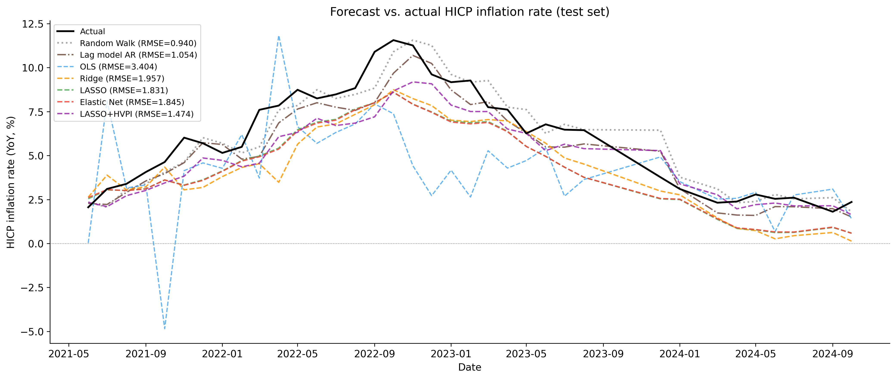

# LASSO & Ridge Regression zur Inflationsprognose

[English version](README.md)

**Seminararbeit, Aktuelle Fragen der Ökonometrie**
Technische Universität Dresden, Sommersemester 2026. Autor: Anton Stahl. Betreuer: Prof. Bernhard Schipp

Prognose der deutschen HVPI-Inflationsrate aus makroökonomischen Indikatoren mit
**Regularisierung (Ridge, LASSO, Elastic Net)**, gemessen **gegen naive Benchmarks
(Random Walk, AR)**.

**Forschungsfrage:** Schlagen makroökonomische Prädiktoren mit Ridge/LASSO die reine
Inflationspersistenz (Random Walk)?
**Kernbefund:** Regularisierung behebt das massive Overfitting von OLS (Test-R² -0,40 auf 0,77, Adaptive LASSO),
**schlägt den Random Walk aber nicht**. Der Makro-Mehrwert über die Persistenz hinaus ist
nahe null. Die Analyse demonstriert damit Regularisierung und Variablenselektion bei vielen,
stark kollinearen Prädiktoren *und* ordnet ihren Prognosewert ehrlich gegen den naiven
Benchmark ein.



---

## Projektstruktur

```
RIDGE-LASSO-Inflation-Econometrics-SS26/
├── README.md                    Englische Version
├── README_DE.md                 Diese Datei (Deutsch)
├── LICENSE                      MIT-Lizenz (Code)
├── requirements.txt             Gepinnte Abhängigkeiten (getestet mit Python 3.13)
├── notebooks/
│   └── LASSO_Ridge_Inflationsprognose.ipynb   Haupt-Analysenotebook (mit Outputs)
├── src/                         Python-Paket, wiederverwendbare Analyse-Funktionen
│   ├── config.py                Pfade, Seeds, Hyperparameter-Grids, CV-Objekte, Reihendefinitionen
│   ├── data_preparation.py      Datenabruf (ECB/Eurostat API + CSV-Cache)
│   ├── data_preprocessing.py    YoY-/MoM-Transformation, Lag-Feature-Engineering, Train/Test-Split
│   ├── models.py                Adaptive-LASSO-Schätzer (Ridge-initialisiert)
│   ├── training.py              Modellschätzung und Kreuzvalidierung (OLS, Ridge, LASSO, Elastic Net,
│   │                            Adaptive LASSO, AR, LASSO + HVPI-Lags)
│   ├── evaluation.py            Rolling-Origin-OOS, DM-/CW-Tests, Block-Bootstrap, Regime-Analyse,
│   │                            Giacomini-Rossi-Test, Horizont-Analyse, Robustheitschecks
│   └── reporting.py             Abbildungen (fig_01 bis fig_14), CSV-/LaTeX-Tabellen, README-Sync
├── tests/                       pytest-Suite für die Funktionen in src/
├── data/
│   ├── raw/data_raw.csv         Rohdaten (Index-/Quotenwerte, gecacht)
│   └── processed/data_yoy.csv   YoY-transformierte Daten
└── results/
    ├── results_table.csv/.tex         Modellvergleich im festen Split (inkl. Benchmarks)
    ├── inference_table.csv/.tex       DM-/CW-Tests, Block-Bootstrap-KI, Bonferroni-Korrektur
    ├── compare_oos_table.csv          Rolling-Origin-RMSE (festes vs. adaptives λ)
    ├── regime_table.csv/.tex          RMSE im Schock- vs. Disinflationsregime
    ├── gr_table.csv                   Giacomini-Rossi-Fluktuationstest (rollierende Statistik)
    ├── horizons_table.csv/.tex        RMSE je Prognose-Horizont h ∈ {1,3,6,12}
    ├── robustness_extended.csv/.tex   Sample-Verlängerung bis 2025-12 (Post-Schock-OOS-Test)
    ├── robustness_mom_table.csv/.tex  MoM-Zielgröße + Atkeson-Ohanian-Benchmark
    ├── selection_economic.csv/.tex    LASSO-Selektion nach ökonomischem Kanal
    ├── stationarity_table.csv/.tex    ADF-/KPSS-Stationaritätstests
    ├── sources_table.csv/.tex         Datenquellen (Variable → ECB/Eurostat-Code)
    └── figures/                       fig_01_hvpi_zeitreihe.png ... fig_14_giacomini_rossi.png
```

## Datenquellen

| Rolle | Quelle | Reihe(n) |
|-------|--------|----------|
| Zielvariable | ECB Data Portal | HVPI Deutschland `ICP/M.DE.N.000000.4.INX` |
| Prädiktoren | Eurostat | Industrieproduktion, Business Surveys, Produzentenpreise, Arbeitslosigkeit, Lohnkostenindex |

33 Prädiktor-Reihen → 165 Lag-Features (5 Lags × 33 Reihen), nach NaN-Filter **155 Features** (Prognose-Horizont 1 Monat).
Die vollständige Liste der Reihen und Datensatz-Codes steht in `results/sources_table.csv`.

> **Hinweis zum Stichprobenfenster:** Der Roh-Cache (`data/raw/data_raw.csv`) reicht
> bis **2026-05**. IP- und PPI-Reihen wurden auf Basisjahr I21 (2021=100) umgestellt
> (I15 endete bei 2023-12, Wachstumsraten inhaltlich identisch). Das kürzeste Prädiktorende
> liegt bei `BS_Produktionserwart` 2024-09, daher reicht die Feature-Matrix bis ca. **2024-10**. Das
> `dropna` schneidet dann auf das gemeinsame Beobachtungsfenster zu.

> **Hinweis zur Datenquelle:** Der ursprüngliche Vorgehensplan sah die Deutsche
> Bundesbank (SDMX) vor. Deren API war aus der Arbeitsumgebung nicht erreichbar,
> daher wird auf ECB + Eurostat zurückgegriffen (EU-harmonisiert, inhaltlich
> gleichwertig). Diese Abweichung ist in der Arbeit dokumentiert.

## Reproduktion

Benötigt Python 3.13 (die Versionen in `requirements.txt` sind die getestete Umgebung).
Daten werden aus `data/raw/data_raw.csv` gecacht. Nur beim ersten Lauf (oder mit
`use_cache=False`) wird von ECB + Eurostat geladen.

```bash
python3 -m venv .venv
source .venv/bin/activate
pip install -r requirements.txt

# 1) Testsuite ausführen (sichert die wiederverwendbaren Funktionen in src/ ab)
pytest tests/

# 2) Notebook von vorne durchlaufen lassen (erzeugt alle results/-Artefakte + Abbildungen)
jupyter nbconvert --to notebook --execute --inplace \
    notebooks/LASSO_Ridge_Inflationsprognose.ipynb
```

Oder einfach interaktiv in Jupyter / VS Code öffnen, Kernel neu starten und "Run All".
Der optionale adaptive Rolling-Origin-Lauf (`RUN_ADAPTIVE_RO` in Abschnitt 4.5) dauert etwa
10 bis 20 Minuten. Für einen schnelleren Lauf auf `False` setzen.
Das Notebook ist die zentrale, alleinige Auswertung. `src/` enthält nur die
wiederverwendbaren Funktionen, `tests/` sichert sie ab.
Das eingecheckte Notebook enthält bereits die Outputs des letzten Laufs, und die
Abbildungen liegen zusätzlich als PNG in `results/figures/`.

## Ergebnis-Überblick (letzter Lauf)

<!-- RESULTS:BEGIN -->
Datensatz: **261 Beobachtungen** (2002-01 - 2024-10), davon **225 Training / 36 Test**
(Testfenster 2021-06 - 2024-10), **155 Features**.

**Testfenster (fester chronologischer Split), RMSE in Prozentpunkten der Inflationsrate.**
Test = DM (nicht-geschachtelt, zweiseitig) oder CW (geschachtelt, Clark & West 2007, einseitig). \* p<0,10, \*\* p<0,05 (unkorrigiert), n.s. = nicht signifikant.

| Modell | λ | Test-RMSE | RMSE/RW | Test-R² | Test | Koeff. ≠ 0 |
|--------|----------:|----------:|--------:|--------:|-----:|-----------:|
| *- Benchmark -* | | | | | | |
| **Random Walk** | - | **0.94** | **1.00** | 0.89 | - | - |
| Lag-Modell (AR) | - | 1.05 | 1.12 | 0.87 | CW  * | 5 |
| *- Zentraler Vergleich: Eigen-Lags + Makro (ökonomisch sauber, ceteris paribus) -* | | | | | | |
| LASSO + HVPI-Lags | 0.064 | 1.47 | 1.57 | 0.74 | CW  n.s. | 7 / 160 |
| *- Didaktisch: nur Makro, ohne Eigen-Lags (strukturell benachteiligt) -* | | | | | | |
| Adaptive LASSO | 0.00032 | 1.38 | 1.47 | 0.77 | DM  * (RW besser) | 50 / 155 |
| LASSO | 0.030 | 1.83 | 1.95 | 0.59 | DM  ** (RW besser) | 29 / 155 |
| Elastic Net | 0.039 | 1.85 | 1.96 | 0.59 | DM  ** (RW besser) | 34 / 155 |
| Ridge | 54.8 | 1.96 | 2.08 | 0.54 | DM  ** (RW besser) | 155 / 155 |
| OLS | - | 3.40 | 3.62 | -0.40 | DM  ** (RW besser) | 155 / 155 |

**Zentraler Befund:** Lag-Modell (AR, nur Eigen-Lags) RMSE/RW = 1.12 und LASSO+HVPI (Eigen-Lags + Makro) RMSE/RW = 1.57, also Makro-Mehrwert über die Persistenz hinaus etwa 0 (ceteris paribus).
Den reinen Makro-Modellen (didaktischer Teil) fehlt der stärkste Einzelprädiktor (HVPI-Lag). Ihr Abschneiden (RMSE/RW ≥ 1.47) illustriert den Nutzen von Regularisierung gegenüber OLS-Overfitting, ist aber **kein fairer Vergleich gegen den RW**.

Inferenztests (T=36): DM = Diebold-Mariano (HLN-korr., zweiseitig) für reine Makro-Modelle. CW = Clark-West (2007, einseitig) für Lag-Modell und LASSO+HVPI (geschachtelt in RW). Nach Bonferroni-Korrektur schlägt kein Modell den RW signifikant (geringe Power bei T=36). Block-Bootstrap-KI: `results/inference_table.csv`.
*Hinweis: Der RW-R² spiegelt die Persistenz der YoY-Rate wider (ŷ_t = y_{t-1} erklärt die Autokorrelation). Er ist nicht mit dem Modell-R² gleichzusetzen.*

**Robustheitscheck (Rolling-Origin, Expanding Window):** RW 0.94 - AR 0.95 - LASSO+HVPI 0.95 -
LASSO 1.09 - Elastic Net 1.09 - Ridge 1.16 - OLS 2.34. Die geschachtelten Modelle (AR, LASSO+HVPI)
erreichen den RW hier knapp, schlagen ihn aber nicht nachweisbar (Clark-West-Test n.s.).

**Robustheit Sample-Verlängerung:** Entfernt man die einzige bindende Reihe (`BS_Produktionserwart`, endet 2024-09), reicht das OOS-Fenster bis **2025-12** (+14 Monate, Post-Schock-Segment 2023-04-2025-12, n=28, vorher 14). Im ruhigeren Post-Schock-Regime schlagen **AR, LASSO+HVPI** den RW signifikant (DM/CW p<0,10 unkorrigiert, nach Bonferroni-Korrektur n.s.; bestes Modell LASSO+HVPI, RMSE/RW=0.95). Damit ist die These *RW unschlagbar* erstmals out-of-sample außerhalb des Energiepreisschocks geprüft. Tabelle: `results/robustness_extended.csv`.
<!-- RESULTS:END -->

### Kernbefunde

1. **Regularisierung behebt OLS-Overfitting.** OLS ist bei p/n ≈ 0,69 und starker
   Multikollinearität unbrauchbar (Test-R² -0,40). Ridge, LASSO, Elastic Net und Adaptive LASSO
   stabilisieren die Schätzung deutlich (R² bis 0,77 mit Adaptive LASSO, 0,74 mit LASSO+HVPI-Lags),
   und LASSO selektiert dabei nur 29 von 155 Features.
2. **Kein Modell schlägt den naiven Random Walk bei kurzen Horizonten.** Bei h ∈ {1, 3, 6} ist der
   Random Walk die härteste Messlatte, und die makroökonomischen Modelle liegen darüber. Erst bei
   h = 12 unterbieten LASSO/Elastic Net (RMSE/RW ≈ 0,90) und Ridge (≈ 0,96) den schwachen
   12-Monats-Random-Walk `ŷ_t = y_{t-12}` in der Punktschätzung (die Horizont-Analyse enthält
   keinen Signifikanztest).
3. **Makro-Mehrwert ≈ 0.** Auch mit den HVPI-Eigen-Lags *erreicht* LASSO+HVPI den RW im
   Rolling-Origin-Design nur (RMSE/RW ≈ 1,01, gleichauf mit dem reinen AR-Modell), schlägt ihn aber
   nicht. Die reinen Makro-Modelle sind strukturell benachteiligt, weil ihnen der beste
   Einzelprädiktor fehlt, nämlich die letzte Inflationsrate.

Das deckt sich mit der Literatur zur Inflationsprognose (Atkeson & Ohanian 2001, Stock &
Watson 2007), wonach strukturelle Modelle den naiven Benchmark in der Regel nicht schlagen. Die
Diebold-Mariano- und Clark-West-Tests (T=36) bestätigen, dass kein Modell den RW
nachweisbar auf dem 5-%-Niveau schlägt.

4. **Kontrast zu Medeiros et al. (2021).** Medeiros, Vasconcelos, Veiga & Zilberman (JBES 2021,
   "Forecasting Inflation in a Data-Rich Environment: The Benefits of Machine Learning Methods")
   zeigen für US-CPI robuste ML-Prognosevorteile. Es gibt vier Erklärungen für den ausbleibenden
   ML-Vorteil im deutschen HVPI-Setting, und jede knüpft direkt an die eigenen Ergebnisse an.
   (a) Das Testfenster 2021 bis 2024 ist vollständig vom größten Energiepreisschock der Stichprobe
   dominiert. Bei einer nahe-I(1)-Reihe ist der Random Walk im Schock-Regime mechanisch kaum zu
   schlagen (Regime-Analyse und Giacomini-Rossi-Test, Notebook-Abschnitte 4.5.2 und 4.5.3, bestätigen
   dies quantitativ).
   (b) YoY-Raten tragen eine starke Persistenzautokorrelation durch den 12-Monats-Kumulationseffekt.
   Der YoY-Random-Walk ist damit ein außerordentlich starker Benchmark, teils ein Artefakt der
   Zielgrößendefinition.
   (c) Die Analyse nutzt ausschließlich lineare Shrinkage-Methoden (Ridge/LASSO/EN), während Medeiros
   et al. Random Forests mit Nichtlinearitäts- und Interaktionspotenzial einsetzen.
   (d) Die EU-Stichprobe (2002 bis 2024, 261 Beob.) ist kürzer und durch die Nullzinsbindungsära
   (2015 bis 2021) mit geringer Inflationsvarianz dominiert. Das schwache Trainingssignal mindert die
   Prädiktorkraft der Makrovariablen im Test.
   Der Null-Befund dieser Arbeit *widerspricht* Medeiros et al. nicht, sondern *ergänzt* ihn: der
   ML-Vorteil ist kontextabhängig und im europäischen, linear-regularisierten Setting mit
   energiepreis-dominiertem Testfenster nicht reproduzierbar.

## Lizenz

Der Code in diesem Repository steht unter der [MIT-Lizenz](LICENSE).
Die Daten in `data/` stammen aus dem ECB Data Portal und von Eurostat (© Europäische Union)
und unterliegen deren Weiterverwendungsbedingungen, die eine freie Nutzung bei Quellenangabe
erlauben. Sie fallen nicht unter die MIT-Lizenz.
